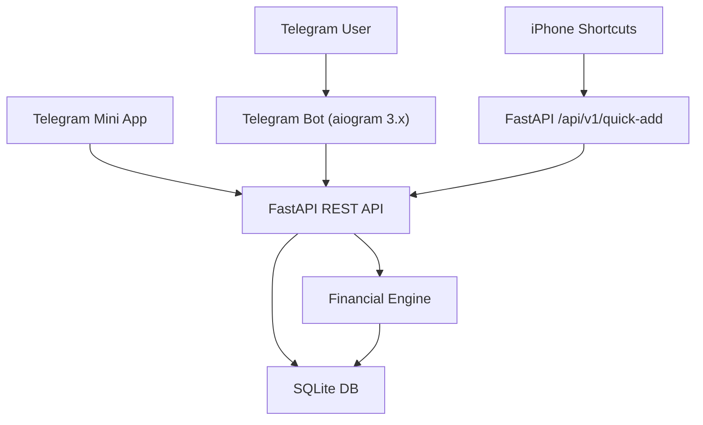

# QALTAM Architecture Map

## Modules

- `backend/app/main.py`
  FastAPI entrypoint, router registration, startup hooks.

- `backend/app/core/`
  Settings, security, constants, database session.

- `backend/app/models/`
  SQLAlchemy ORM models and enums.

- `backend/app/schemas/`
  Pydantic request/response contracts.

- `backend/app/api/`
  Routers for health, dashboard, quick-add, obligations, hypotheses, bot webhook.

- `backend/app/services/`
  Financial engine, parser services, speech/transcription adapters.

- `backend/bot/`
  aiogram bot, handlers, keyboards, webhook bridge.

- `frontend/`
  TMA SPA with Macro, Medium, and Micro focus layers.

## Data Flow

1. Capture events enter through bot text, bot voice, or iOS quick-add.
2. Backend normalizes them into `Transactions`.
3. Financial engine aggregates balances, obligations, and hypotheses.
4. Mini App reads derived views from dashboard endpoints.
5. User explores scenarios in Macro, Medium, and Micro focus levels.
